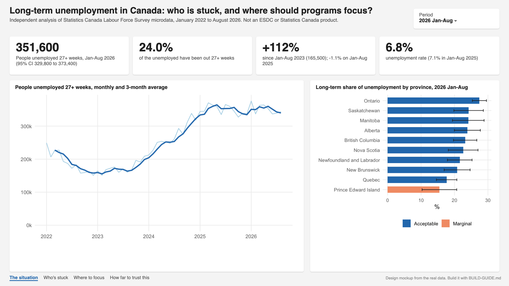
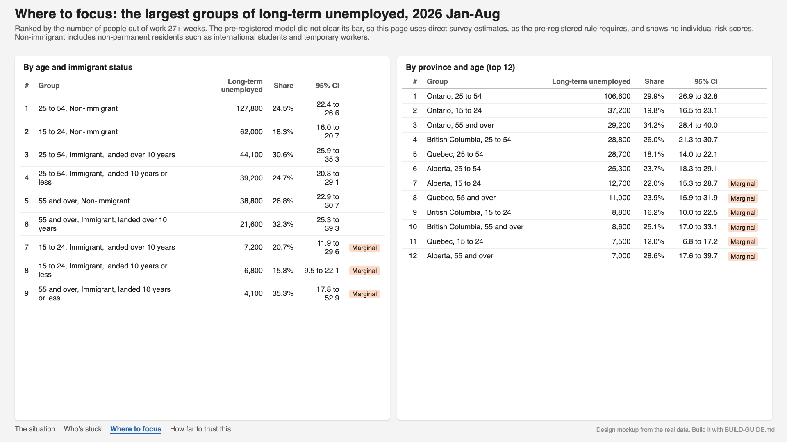
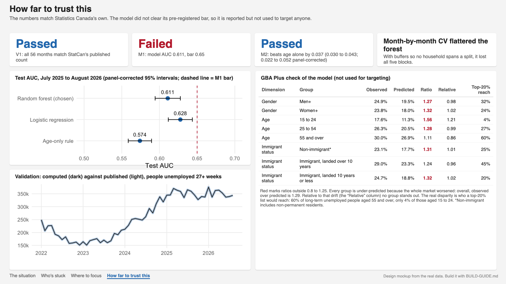
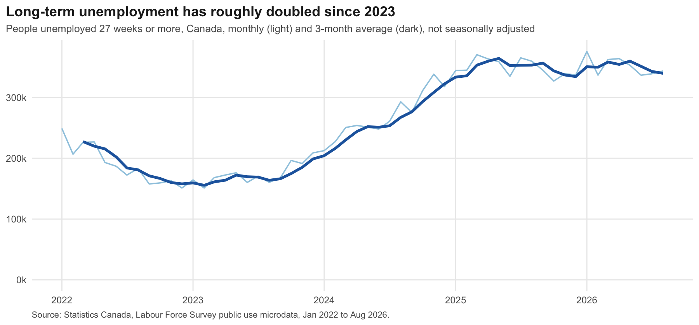
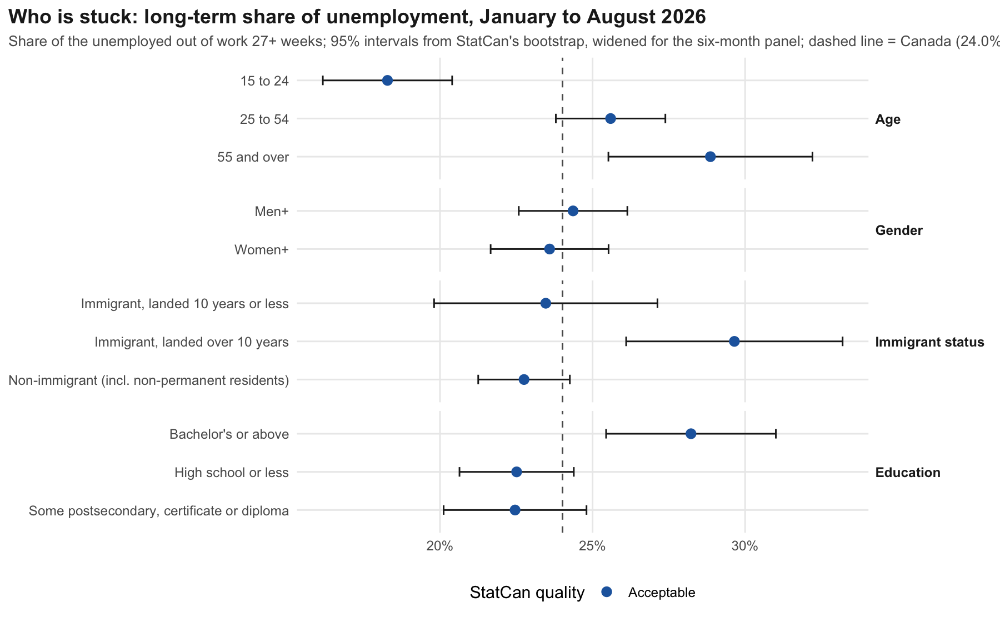
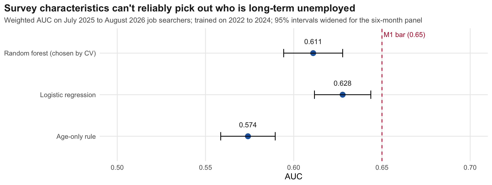
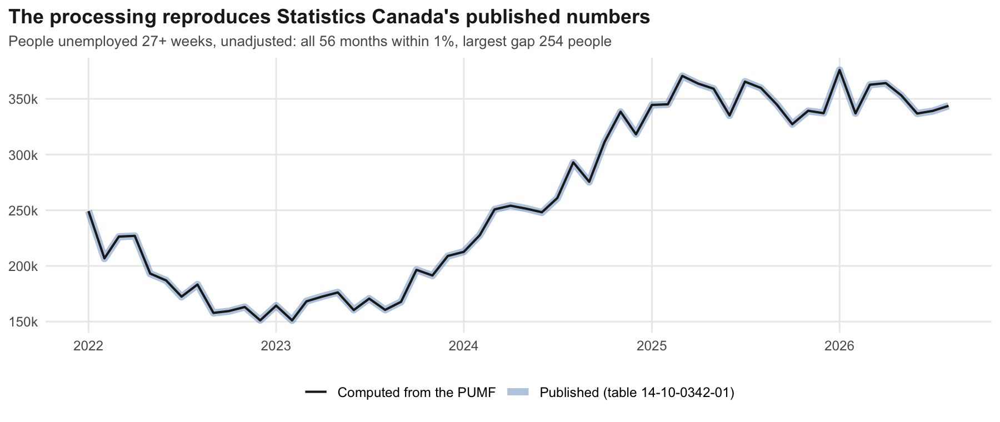

# Who is stuck in long-term unemployment, and where should programs focus?

Long-term unemployment in Canada has more than doubled. On average from January to August 2026, about **351,600 people** had been out of work for 27 weeks or more, against 165,500 in the same months of 2023. Nearly one in four unemployed people (24.0%) has now been out that long. This project asks which groups employment programs, such as ESDC's, should reach first, using Statistics Canada's Labour Force Survey microdata and the agency's own method for margins of error. It was pre-registered, and the registration was published before any model ran.

**Answer:** reach the groups where long-term unemployment is both large and concentrated. Those are prime-age workers in Ontario, immigrants who arrived more than 10 years ago, and people aged 55 and over. Don't build an individual risk score from survey characteristics: the pre-registered test showed they can't tell who is long-term unemployed well enough to target anyone.

This is an independent analysis of public data. It is not an ESDC or Statistics Canada product.

## The pre-registration, and what happened to it

The tests, pass marks and decision rules are in [PREREGISTRATION.md](PREREGISTRATION.md). They were [committed publicly](https://github.com/OneAutomation/long-term-unemployment/commit/da74832) at 3:47 PM EDT on September 25, 2026, before any model was trained. `git show da74832:PREREGISTRATION.md | shasum -a 256` reproduces the recorded hash.

- **V1 validation, passed.** Computed from the microdata, the monthly count of people unemployed 27+ weeks matches Statistics Canada's published table 14-10-0342-01 in all 56 months. The largest gap is 254 people, or 0.14% at most in relative terms. The first run failed because my script mislabelled the API's reordered series; the check stopped the analysis until that was fixed (D1).
- **M1, failed.** The chosen model scored a weighted test AUC of 0.611 against a bar of 0.65.
- **M2, passed.** It beat the age-only rule (0.574) by 0.037, with a pre-registered 95% interval of 0.030 to 0.043, or 0.022 to 0.052 after correcting for the survey's panel.
- **The decision rule applied.** The dashboard ranks groups by direct survey estimates and shows no model risk scores.

An independent review of the code then found real problems. All are fixed and recorded as deviations D3 to D8 below the unchanged original text:

- **A wrong label.** The survey's "non-immigrant" group had been called "born in Canada". It also includes non-permanent residents such as international students and temporary workers.
- **Intervals about twice too narrow.** Households stay in the survey for six months and the public file has no person identifier. Standard errors are now widened by the most that rotation allows (×2.24 for a year, ×2.13 for January to August), and StatCan's "5 respondents" rule is applied as 30 person-months.
- **Mixed-season comparisons.** January-to-August 2026 had been compared with full-year averages. Comparisons now use the same months each year.
- **A misleading model choice.** The forest won cross-validation only because the same households sat on both sides of the split. With five-month buffers between folds it loses to logistic regression in all five blocks (0.623 against 0.642), which matches the test result (0.611 against 0.628).
- **Fairness flags that measured drift, not bias.** All groups were under-predicted because the market worsened. Relative to that overall drift no group stands out, but a top-20% list would reach 60% of long-term unemployed people aged 55 and over and only 4% of those aged 15 to 24.

## The dashboard

The Power BI report is designed as four pages: the situation, who's stuck, where to focus, and how far to trust it. The images below are design mockups rendered from the real data; `powerbi/BUILD-GUIDE.md` builds the report in Power BI Desktop, after which screenshots replace them.





A two-page briefing note is in `reports/briefing-note.pdf` (and `.docx`).

## Who is stuck (January to August 2026)

| | Group | Long-term share of unemployment | 95% interval |
|---|---|---|---|
| | Canada | 24.0% | 22.7 to 25.3 |
| Age | 15 to 24 | 18.3% | 16.2 to 20.4 |
| | 25 to 54 | 25.6% | 23.8 to 27.4 |
| | 55 and over | 28.9% | 25.5 to 32.2 |
| Immigrant status | Landed 10 years or less | 23.5% | 19.8 to 27.1 |
| | Landed over 10 years | 29.6% | 26.1 to 33.2 |
| | Non-immigrant (incl. non-permanent residents) | 22.8% | 21.3 to 24.3 |
| Education | High school or less | 22.5% | 20.6 to 24.4 |
| | Some postsecondary, certificate or diploma | 22.5% | 20.1 to 24.8 |
| | Bachelor's or above | 28.2% | 25.4 to 31.0 |
| Gender | Men+ | 24.4% | 22.6 to 26.1 |
| | Women+ | 23.6% | 21.7 to 25.5 |

All of these meet Statistics Canada's quality rules. Young people are the least likely to be stuck long, even though their unemployment rate is the highest, at 13.8%. Degree holders' long spells deserve a closer look; the survey can show them but not explain them.

By numbers, the largest groups are non-immigrants aged 25 to 54 (127,800), non-immigrant youth (62,000) and immigrants aged 25 to 54 who arrived more than 10 years ago (44,100, whose share, 30.6%, is the highest of these three). By province and age, Ontario's 25 to 54 group alone holds 106,600 long-term unemployed people.






## How it works

1. **Data.** 56 monthly Labour Force Survey public use microdata files (January 2022 to August 2026), 6.2 million person-months. Multi-month averages stack the files and divide the weight by the number of months, as the user guide instructs.
2. **Margins of error.** The user guide's Poisson bootstrap: 1,000 replicate weights with adjustment 1 ± √((w − 1)/w), each calibrated to the survey weight totals in the guide's 220 province × age × gender domains, within each month. Standard errors are widened for the six-month panel (D4). Quality follows the guide's Table 5: acceptable, marginal (CV 15% to 35%, shown with a warning) or suppressed.
3. **Long-term unemployment.** Unemployed 27 weeks or more (`DURUNEMP ≥ 27`), Statistics Canada's threshold. The share leaves future starts out of its denominator, so it runs about one point above the ratio implied by StatCan's published table.
4. **Model test.**
   - **Population:** unemployed job searchers (temporary layoffs and future starts excluded).
   - **Predictors:** characteristics recorded in the survey that don't encode how long someone has been out. The variables that do, such as duration of joblessness, reason for leaving and last industry, were excluded in advance.
   - **Split:** train on 2022 to 2024 and test on July 2025 to August 2026, with January to June 2025 left out so no household spans both.
   - **Models:** an age-only rule, logistic regression and a random forest, all weighted by the survey weights.
   - **Caveat:** job-search methods change with time out of work, so the model describes who is currently stuck rather than predicting it at intake (D8).

## What it can't tell you

- The survey measures spells still under way, not completed ones.
- The panel correction is an upper bound for the overlap of households across months. The bootstrap also ignores the survey's cluster design, which the public file doesn't support, so every interval is approximate.
- The model's calibration drifted because conditions worsened between training and test; any real targeting tool would need regular recalibration.
- Any individual risk-scoring tool used to allocate services would also need an Algorithmic Impact Assessment under the Treasury Board Directive on Automated Decision-Making.

## Run it

```bash
./run_all.sh --fetch
```

It downloads the 12 survey archives from Statistics Canada (161 MB), then rebuilds everything in about 20 minutes, most of it the bootstrap. You need R 4.6 with `data.table`, `ranger`, `jsonlite` and `ggplot2` (versions in `requirements.txt`). Headless Chrome renders the mockups and PDF; set `CHROME` to its path outside macOS. Python 3.12 with `python-docx` writes the Word version of the briefing note. All random streams are seeded.

## Layout

```
PREREGISTRATION.md   tests, pass marks and decision rules (public commit da74832), then deviations D1 to D8
R/                   01_prepare, 02_validate, 03_estimates, 04_model, diag_panel_cv, 05_exports, 06_figures, 07_mockups, 08_briefing
src/                 fetch_lfs.sh, briefing_docx.py
data/processed/      estimates.csv (2,135 estimates with quality flags), model_metrics.json, fairness.csv, validation_v1.csv
powerbi/             data/*.csv, theme.json, measures.dax, BUILD-GUIDE.md, mockups/
reports/             briefing-note.pdf and .docx, figures/
```

## Sources

- Statistics Canada, Labour Force Survey public use microdata files (71M0001X), January 2022 to August 2026, and the LFS PUMF user guide (2025). Statistics Canada Open Licence.
- Statistics Canada, table 14-10-0342-01, Duration of unemployment, monthly, retrieved through the Web Data Service.
- Beaumont, J.-F. and Z. Patak (2012). On the generalized bootstrap for sample surveys with special attention to Poisson sampling. *International Statistical Review* 80(1): 127–148.

Ahmad Bilal Hashimi, 2026. Built with Claude Code, an AI coding assistant, at my direction. An independent AI review checked the code and results against the pre-registration, and every correction it prompted is recorded in `PREREGISTRATION.md`.
